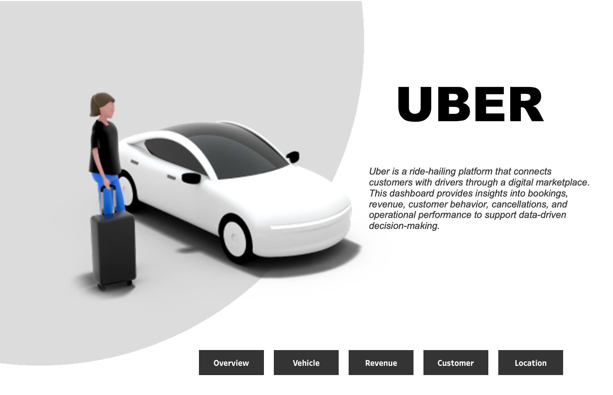
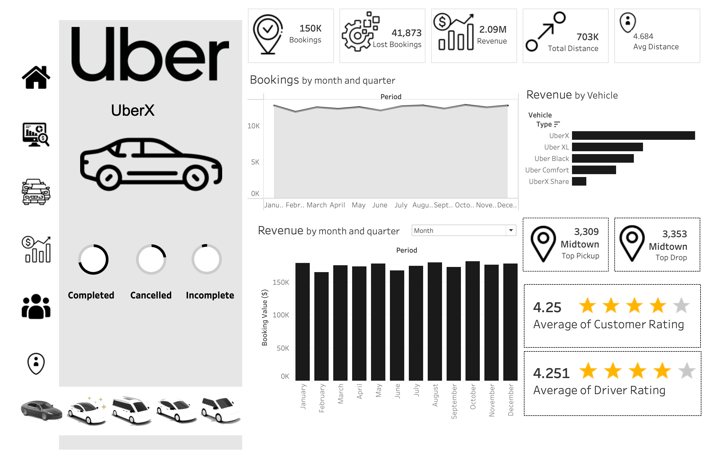
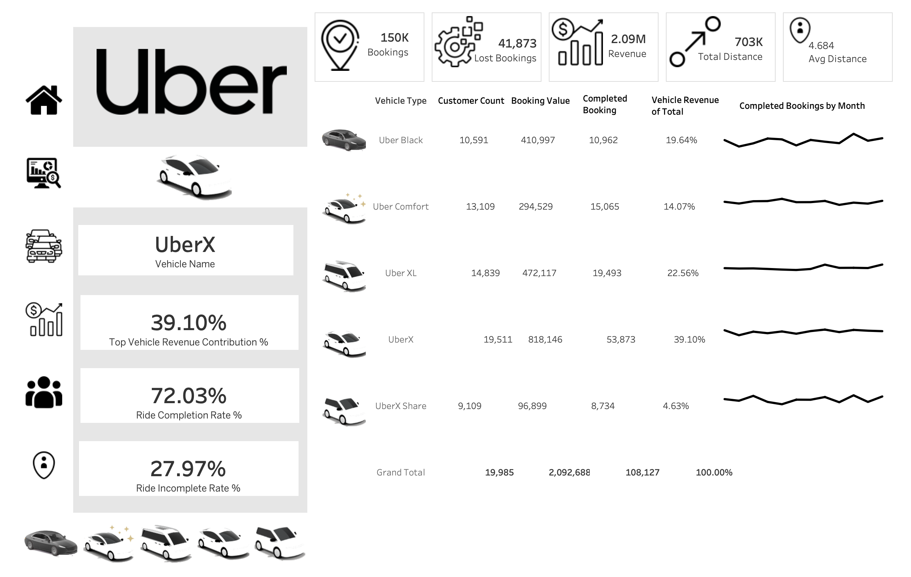
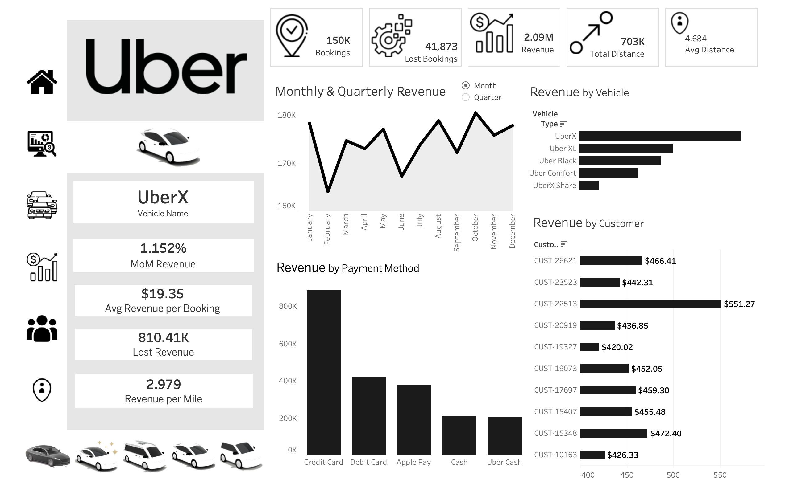
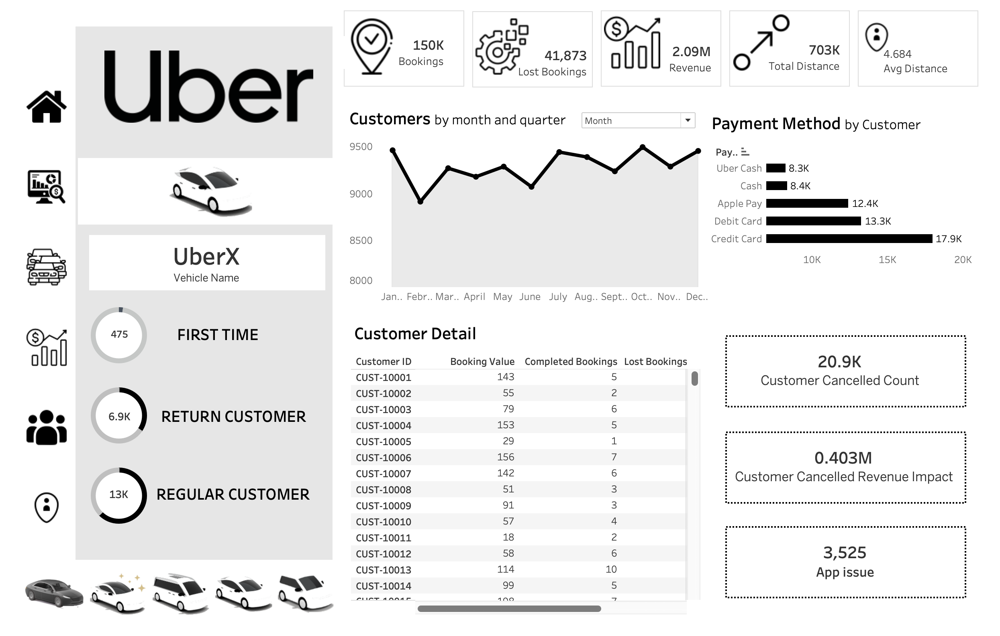
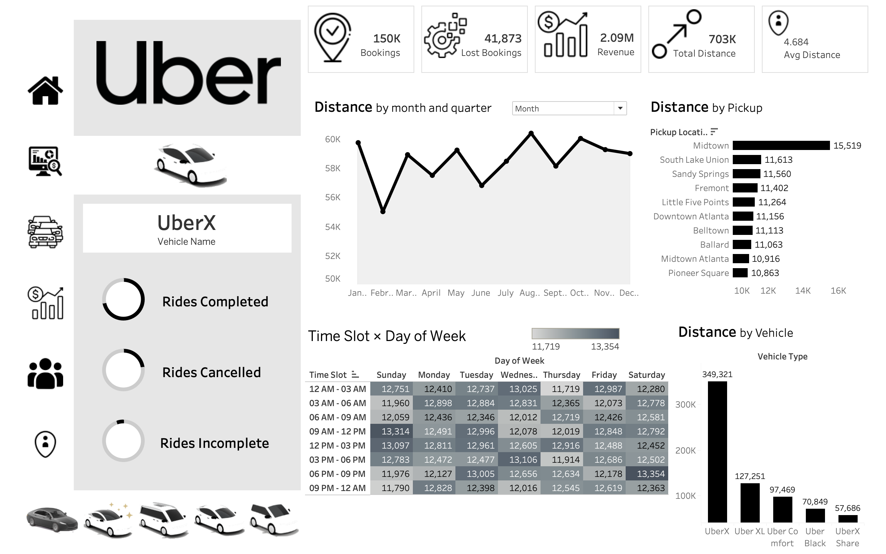

# Uber USA Ride Analytics Dashboard (Tableau)

An end-to-end **Tableau analytics dashboard** designed to analyze Uber ride data across the **United States** and deliver actionable insights across **bookings, revenue, vehicles, customers, and locations**.
This project focuses on **business-driven analytics**, data modeling, calculated fields, dashboard actions, and professional dashboard design.

This is a US recreation of an original Uber India dashboard project, rebuilt from the ground up on a US-market synthetic dataset (8 major US cities) and in **Tableau Desktop** rather than the original tool.

🔗 **[View Live Interactive Dashboard on Tableau Public](https://public.tableau.com/views/Uber_17827445946340/Home?:language=en-US&:display_count=n&:origin=viz_share_link)**

---

## Project Overview

Uber operates at a massive scale across major US cities, handling millions of daily rides. Managing such operations requires transforming raw ride data into **meaningful insights** that support decision-making.
This project addresses key business questions related to **performance monitoring, revenue optimization, customer behavior, and operational efficiency** using Tableau.

Dataset: **150,000 ride-level transactions** across 8 major US cities (New York, Los Angeles, Chicago, Houston, Miami, San Francisco, Seattle, Atlanta) throughout **2024**.

---

## Business Objectives

- Monitor overall ride and revenue performance across US markets
- Identify revenue drivers and loss areas by city and vehicle type
- Analyze vehicle-wise contribution and fleet efficiency
- Understand customer behavior and cancellation impact
- Identify peak demand locations and time slots
- Enable data-driven operational and strategic decisions

---

## Dataset Overview

The dataset represents **ride-level transactional data** and includes:

| Column | Description |
|---|---|
| Booking ID | Unique ride identifier (BK-USA-XXXXXX) |
| Date / Time | Ride timestamp (2024, full year) |
| Month / Quarter / Day of Week / Hour | Time attributes for trend analysis |
| Booking Status | Completed, Cancelled by Customer, Cancelled by Driver, No Drivers Available |
| Vehicle Type | UberX, Uber XL, Uber Black, Uber Comfort, UberX Share |
| Customer ID | Anonymized customer identifier |
| City | One of 8 major US cities |
| Pickup Location | US neighborhood / district |
| Drop Location | US neighborhood / district |
| Distance (Miles) | Trip distance in miles |
| Booking Value ($) | Fare in USD |
| Payment Method | Credit Card, Debit Card, Apple Pay, Cash, Uber Cash |
| Customer Rating | Rider's rating of driver (1–5) |
| Driver Rating | Driver's rating of rider (1–5) |
| Cancellation Reason | Reason for cancellation (if applicable) |

Data is analyzed on **monthly and quarterly** levels to identify trends and patterns.

---

## Cities & Locations

| City | Sample Neighborhoods |
|---|---|
| New York | Manhattan, Brooklyn, Queens, Bronx, Williamsburg, Harlem |
| Los Angeles | Downtown LA, Hollywood, Santa Monica, Beverly Hills, Venice |
| Chicago | The Loop, River North, Wicker Park, Lincoln Park, Gold Coast |
| Houston | Downtown Houston, Midtown, The Woodlands, Montrose, Galleria |
| Miami | South Beach, Brickell, Wynwood, Coral Gables, Coconut Grove |
| San Francisco | Financial District, Mission District, SoMa, Castro, Nob Hill |
| Seattle | Capitol Hill, Belltown, Fremont, Queen Anne, Bellevue |
| Atlanta | Midtown Atlanta, Buckhead, Downtown Atlanta, Decatur |

---

## Vehicle Types

| Vehicle Type | Description | Fare Multiplier |
|---|---|---|
| UberX | Standard sedan, most affordable | 1.0x |
| Uber Comfort | Newer, roomier cars with extra legroom | 1.3x |
| Uber XL | SUV or minivan for groups up to 6 | 1.6x |
| Uber Black | Premium, luxury rides | 2.5x |
| UberX Share | Shared rides, lowest fare | 0.7x |

---

## Dashboard Architecture

The dashboard is structured into **five analytical pages**, each serving a specific business requirement:

1. Overview
2. Vehicle
3. Revenue
4. Customer
5. Location

Interactive navigation icons and dashboard actions (filter / change-parameter) allow seamless movement between pages, with hero KPI cards, sparklines, and custom Uber vehicle-type shapes used throughout for a polished, product-style look.

---

## Page-wise Business Explanation

---

### 1️⃣ Home / Landing Page

**Purpose**
- Introduces the Uber USA analytics dashboard
- Provides context and navigation for users

**Key Features**
- Uber branding and visual identity
- Brief description of dashboard purpose
- Navigation buttons to all analytical pages

---

### 2️⃣ Overview Page

**Business Requirement**
Provide a high-level snapshot of Uber USA's operational and financial performance.

**KPIs Displayed**
- Total Bookings
- Lost Bookings (Cancelled + No Drivers Available)
- Total Revenue ($)
- Total Distance (Miles)
- Average Distance per Ride (Miles)

**Insights Provided**
- Monthly and quarterly booking trends (2024)
- Revenue trends over time
- Revenue by vehicle type
- Top pickup and drop locations by city
- Average customer and driver ratings

---

### 3️⃣ Vehicle Page

**Business Requirement**
Analyze performance at the vehicle level to optimize fleet usage.

**Key Metrics**
- Booking count by vehicle type
- Revenue by vehicle type
- Revenue contribution percentage
- Ride completion rate
- Ride incomplete rate

**Insights Provided**
- UberX as volume leader; Uber Black as revenue-per-ride leader
- Completion efficiency comparison across vehicle types
- Sparkline trends for completed bookings

---

### 4️⃣ Revenue Page

**Business Requirement**
Provide detailed financial insights and identify revenue risks.

**Key Analysis**
- Monthly and quarterly revenue trends
- Revenue by vehicle type
- Revenue by payment method (Credit Card, Debit Card, Apple Pay, Cash, Uber Cash)
- Revenue by top customers

**Efficiency & Risk Metrics**
- Month-on-Month revenue change
- Average revenue per booking ($)
- Revenue per mile ($)
- Lost revenue estimation (cancellations)

---

### 5️⃣ Customer Page

**Business Requirement**
Understand customer behavior, loyalty, and cancellation impact.

**Customer Segmentation**
- First-time customers
- Returning customers (2–4 rides)
- Regular customers (5+ rides)

**Key Metrics**
- Customer cancellation rate
- Customer cancellation count
- Revenue risk percentage due to cancellations
- Estimated revenue impact

**Insights Provided**
- Top customer cancellation reasons (e.g., Driver took too long, Changed plans)
- Customer trend over time
- Payment method preference
- Detailed customer-level table

---

### 6️⃣ Location Page

**Business Requirement**
Analyze geographic and time-based demand patterns across US cities.

**Key Insights**
- Total distance by vehicle type (miles)
- Distance covered by city and neighborhood
- Top active pickup/drop areas per city
- Peak demand time slots
- Day-wise and hour-wise heatmap analysis

---

## Tools & Technologies Used

- **Tableau Desktop**
- Calculated Fields & Parameters
- Dashboard Actions (Filter / Change Parameter) for cross-page navigation and highlighting
- Floating-object layout design (KPI cards, sparklines, custom shape icons)
- Data Modeling & Relationships
- Time Intelligence (month/quarter trend analysis)
- KPI Design & Dashboard UX Principles

---

## Payment Methods

| Method | Share |
|---|---|
| Credit Card | ~42% |
| Debit Card | ~20% |
| Apple Pay | ~18% |
| Cash | ~10% |
| Uber Cash | ~10% |

---

## Business Impact

This dashboard enables Uber USA stakeholders to:

- Track business performance across 8 major US markets
- Identify revenue growth and loss areas by city and vehicle type
- Improve fleet and driver utilization
- Reduce ride cancellations
- Enhance customer satisfaction
- Make informed, data-driven decisions

---

## Key Learnings

- End-to-end Tableau dashboard development
- Translating business requirements into analytics
- Practical use of calculated fields, parameters, and dashboard actions for real-world problems
- Data storytelling and professional dashboard design
- UX considerations for enterprise dashboards

---

## Future Enhancements

- Real-time data integration via Uber API
- Predictive demand forecasting by city
- Customer churn prediction model
- Driver performance and earnings analytics
- Surge pricing pattern analysis
- Publish to Tableau Public/Server for live, interactive sharing

---

## Repository Contents

| File / Folder | Description |
|---|---|
| `Uber_USA_Dataset.xlsx` | Source dataset (150,000 rides, 19 features) |
| `Uber_USA_Dashboard_Insight_Report.docx` | Written insight report / findings |
| `Uber_USA_Dashboard_Presentation.pptx` | Presentation summarizing the project |
| `Uber_USA_Revenue_Page_Build_Guide.docx` | Build notes for the Revenue page |
| `IMG_VehicleTypes.csv` | Vehicle type reference data |
| `dashboard_images/` | Icons, nav buttons, and custom vehicle-type shapes used in the dashboard |
| `btn_*.png` | Navigation button assets |
| `Screenshots/` | Full-page screenshots of each dashboard page |
| `Uber_USA_Dashboard.twbx` | The Tableau packaged workbook — open in Tableau Desktop (or Tableau Public) to interact with the live dashboard |

---

## Note

This project is created for **learning, portfolio, and demonstration purposes** using a synthetic dataset of **150,000 rows** and **19 features**, modeled after real-world Uber USA operations.
